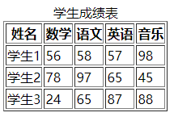

## HTML 表格
表格由`<table>`标签来定义。每个表格均有若干行（由 `<tr>`标签定义），每行被分割为若干单元格（由`<td>`标签定义）。字母 td 指表格数据（table data），即数据单元格的内容。
表格的表头使用`<th>`标签进行定义
```
<!DOCTYPE html>
<html>
	<head>
		<meta charset="utf-8">
		<title></title>
	</head>
	<body>
		<table border="1">
			<caption>学生成绩表</caption>
			<thead>
				<tr>
					<th>姓名</th>
					<th>数学</th>
					<th>语文</th>
					<th>英语</th>
					<th>音乐</th>
				</tr>
			</thead>
			<tbody>
				<tr>
					<td>学生1</td>
					<td>56</td>
					<td>58</td>
					<td>57</td>
					<td>98</td>
				</tr>
				<tr>
					<td>学生2</td>
					<td>78</td>
					<td>97</td>
					<td>65</td>
					<td>45</td>
				</tr>
				<tr>
					<td>学生3</td>
					<td>24</td>
					<td>65</td>
					<td>87</td>
					<td>88</td>
				</tr>
			</tbody>
		</table>
	</body>
</html>
```
运行结果：


**HTML 表格标签**

|标签|描述|
|----|----|
|`<table>`|定义表格|
|`<th>`|定义表格的表头|
|`<tr>`|定义表格的行|
|`<td>`|定义表格单元|
|`<caption>`|定义表格标题|
|`<colgroup>`|定义表格列的组|
|`<col>`|定义用于表格列的属性
|`<thead>`|定义表格的页眉|
|`<tbody>`|定义表格的主体|
|`<tfoot>`|定义表格的页脚|

<br>

## HTML 列表
- 无序列表使用`<ul>`标签
```
<ul>
<li>Coffee</li>
<li>Milk</li>
</ul>
```
- 有序列表始于`<ol>`标签。每个列表项始于`<li>`标签
```
<ol>
<li>Coffee</li>
<li>Milk</li>
</ol>
```
- 自定义列表以`<dl>`标签开始。每个自定义列表项以`<dt>`开始。每个自定义列表项的定义以`<dd>` 开始
```
<dl>
<dt>Coffee</dt>
<dd>- black hot drink</dd>
<dt>Milk</dt>
<dd>- white cold drink</dd>
</dl>
```
**HTML 列表标签**
|标签|描述|
|----|----|
|`<ol>`|定义有序列表|
|`<ul>`|定义无序列表|
|`<li>`|定义列表项|
|`<dl>`|定义列表|
|`<dt>`|自定义列表项目|
|`<dd>`|定义自定列表项的描述|

<br>

## HTML 区块
HTML 可以通过`<div>`和`<span>`将元素组合起来

- HTML`<div>`元素
HTML`<div>`元素没有特定的含义。除此之外，由于它属于块级元素，浏览器会在其前后显示折行。如果与 CSS 一同使用，<div> 元素可用于对大的内容块设置样式属性。


- HTML`<span>`元素
HTML`<span>`元素是内联元素，可用作文本的容器.`<span>` 元素也没有特定的含义。当与 CSS 一同使用时，`<span>`元素可用于为部分文本设置样式属性