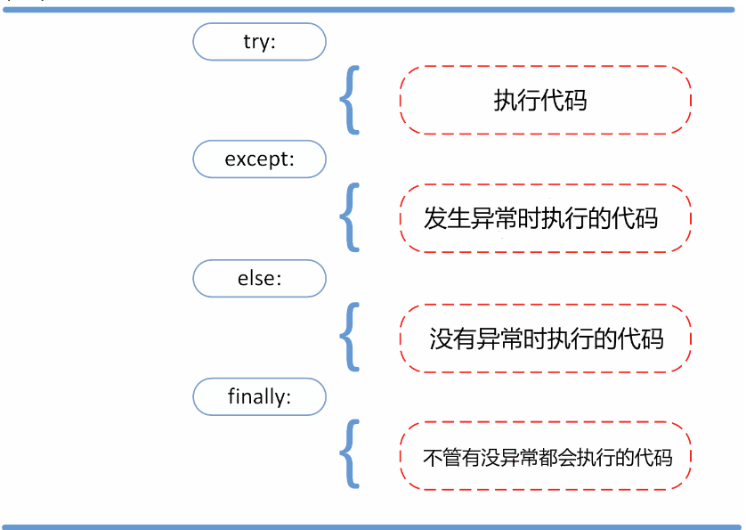

# <center> 错误与异常

## 语法错误
Python 的语法错误或者称之为解析错

<br>

## 异常
- 即便 Python 程序的语法是正确的，在运行它的时候，也有可能发生错误。运行期检测到的错误被称为异常。
- 异常以不同的类型出现，这些类型都作为信息的一部分打印出来: 例如类型有 ZeroDivisionError，NameError 和 TypeError

<br>

## 异常处理
- 异常捕捉可以使用 try/except/else/finally 语句
- 如果多个except,异常类型顺序需要注意，最大的Exception要放到最后
- 如果使用else则在try代码中不能出现return
```python
def sum():
    try:
        number1 = int(input("请输入第一个数字："))
        number2 = int(input("请输入第二个数字："))
        operat = input("请输入运算符号(+ - * /)")
        
        if operat == '+':
            result = number1 + number2
        elif operat == '-':
            result = number1 - number2
        elif operat == '*':
            result = number1 * number2
        elif operat == '/':
            result = number1 / number2
        print(result)
    except ValueError:
        print('请输入数字')
    except ZeroDivisionError:
        print('被除数不能为0')
    except Exception:
        print('出错啦')
    
        
sum()
```
```python
    
def function():
    try:
        stream = open(r'C:\Users\Administrator\Desktop\text.txt')
        message = stream.read()
        print(message)
        return 1
    except Exception as err:
        print("错误类型：", err)
    finally:
        stream.close() #无论文件是否找到都要释放资源
        return 2
        
result = function()
print(result)  # result = 2
```


## 异常捕获
```python
def list_function():
    try:
        list = []
        list.pop()
    # 异常捕获
    except Exception as err:
        print("错误类型为：", err)  # 错误类型为： pop from empty list


list_function()
```

<br>

## 抛出异常
Python 使用 raise 语句抛出一个指定的异常。
raise语法格式：raise [Exception [, args [, traceback]]]
```python
def register():
    username = input("输入用户名：")
    if len(username) < 6:
        raise Exception("用户名长度必须是6位以上！")
    else:
        print('输入的用户名是：', username)
        
try:
    register()
except Exception as err:
    print("错误类型为", err)
else:
    print("注册成功！")
```