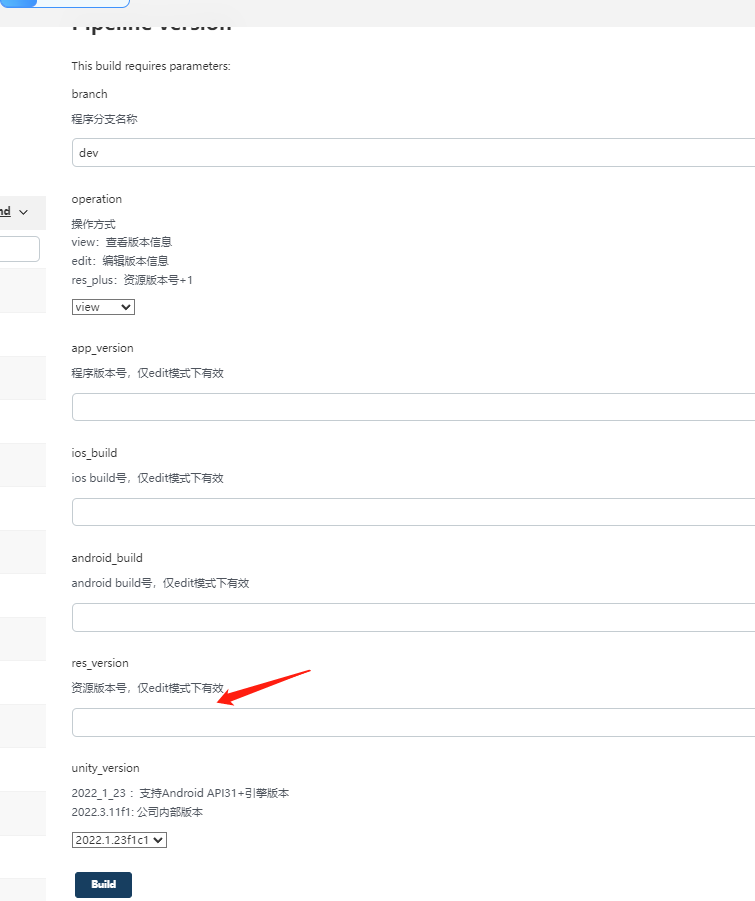
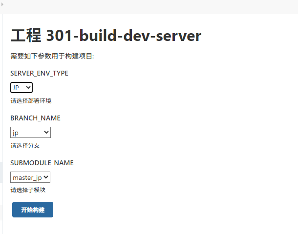
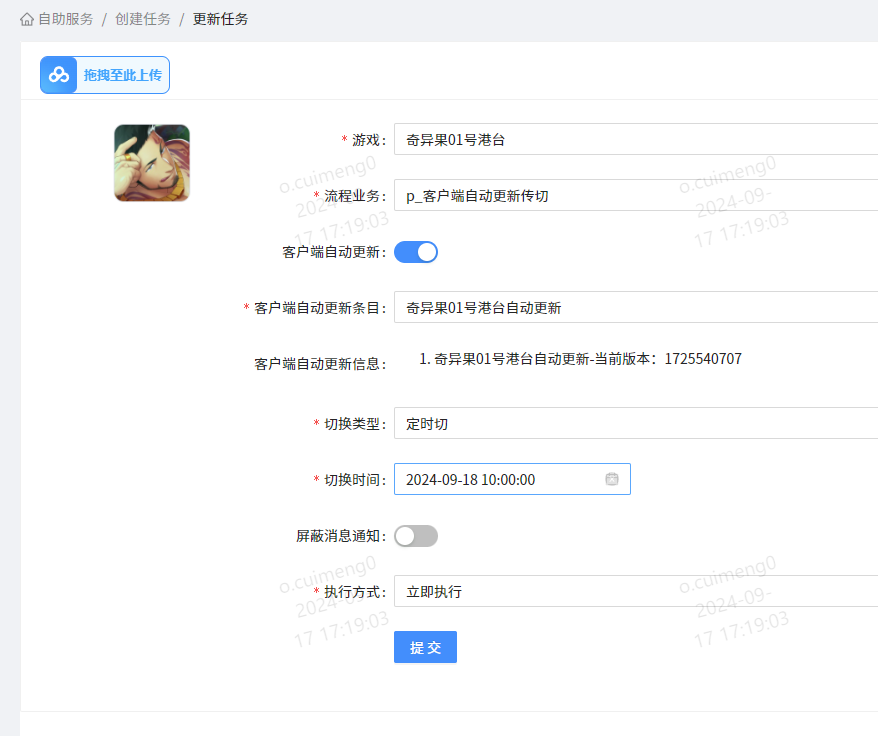
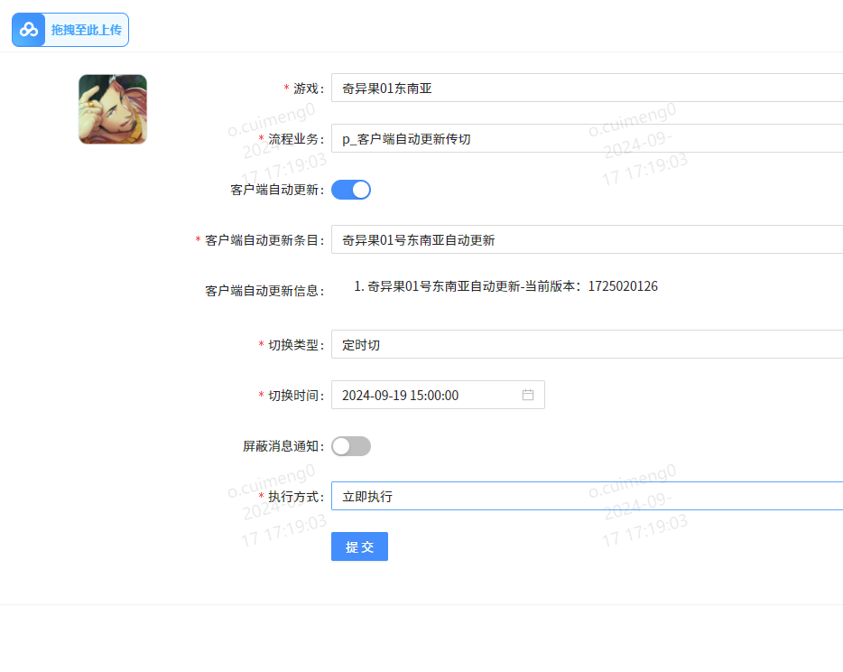
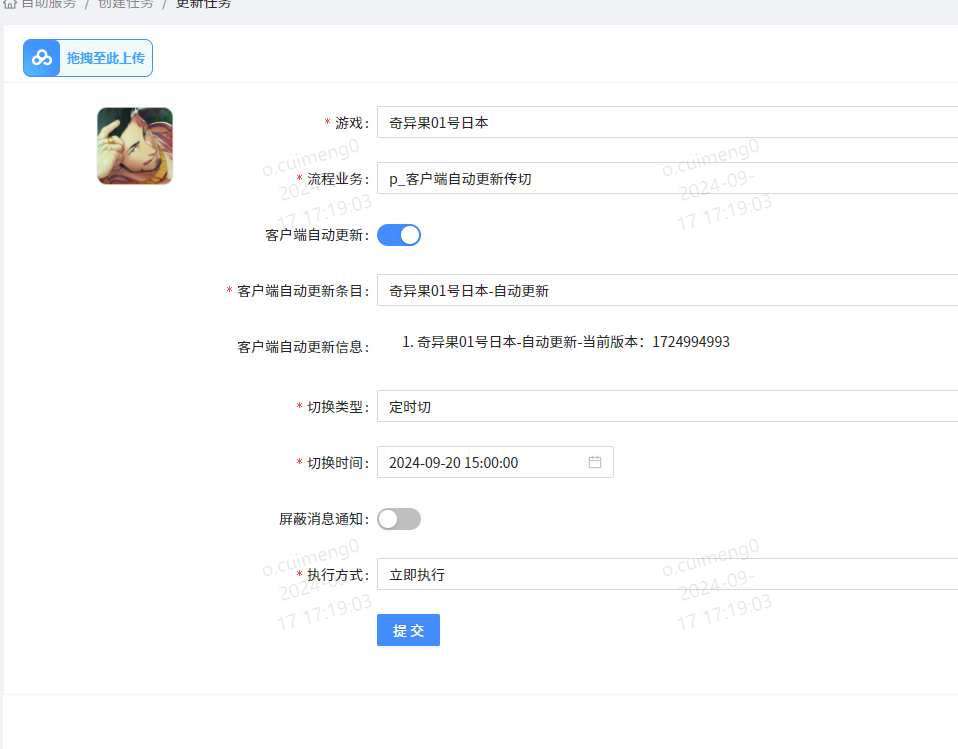

打包机地址[http://10.0.10.29:8080/](http://10.0.10.29:8080/)
开发服部署地址：http://10.0.10.5:8080/
![[Pasted image 20240906133501.png]]

## 打包流程顺序
- 第一步：升级资源版本号
	- 程序分支名称：中文：hotfix  英文：hotfix_en 日本：hotfix_jp  开发服分支：dev
	- 操作方式
		- view：输入相应分支名，查看分支名版本
		- edit：编辑版本信息，在版本号出现错误时，可以选择此选项，来编辑当前版本号。比如不小心连续升了两次资源版本号（从1.19.56升到了1.19.58），想要修正，选择此选项，在以下图片这里输入正确的版本号：1.19.57

		- res_plus:资源版本号+1。每次打热更包前都需要将资源版本号+1
	- unity_version：咱们gyee的unity版本是：2022.1.23f1c1。默认是这个选项
	中文示例：
![[Pasted image 20240906134935.png]]
- 第二步：同步美术资源：有美术资源上传和修改才需要同步，没有可略过
中文示例
![[Pasted image 20240906135412.png]]
- 第三步：打策划包
	- 分支对应语言 hotfix - cn 、hotfix - tw（当需要打tw包时） 、hotfix_en - en、hotfix_jp - jp
	- 编译模式: 
		- debug:打策划包默认是debug模式。debug模式会带有一些调试信息
		- release：不带有调试信息，编译器会对代码进行各种优化。
中文示例![[Pasted image 20240906135613.png]]
- 第四部：同步配表
	- 分支对应语言：hotfix - zh、hotfix_en - en、hotfix_jp - jp
	- 策划数据版本：打热更包需要使用release版本
中文示例
 ![[Pasted image 20240906140413.png]]
- 第五步 热更包
 中文示例
![[Pasted image 20240917163951.png]]

- 本地化同步：本地化.txt文件有修改的时候需要同步，在打热更包之前执行
中文示例：
   ![[Pasted image 20240917164321.png]]

## 开发服部署

## 流程平台外切

